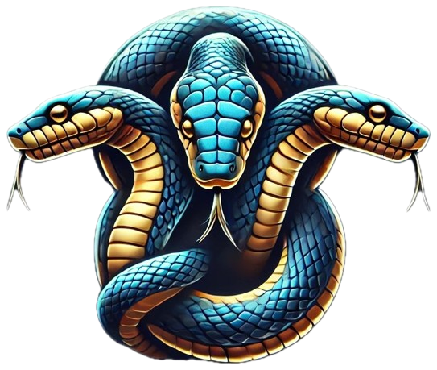

<div align="center">
  
</div>

> **🚧 Currently Under Development 🚧** - We are actively building the core engine of PyOrion.

---

# PyOrion

**PyOrion** is a cutting-edge framework designed to generate highly efficient, compact binary files for major desktop platforms. It allows developers to integrate any front-end framework that compiles to HTML, JavaScript, and CSS, enabling the creation of engaging and dynamic user interfaces. The backend is powered by a Python library, providing a robust API for seamless front-end communication.

> [!NOTE]  
><p><em>🚨 PyOrion's core relies on the [TAO](https://github.com/tauri-apps/tao) Rust library for cross-platform window management, supporting macOS, Windows, Linux, Android, and iOS. 🚨 WebView Rendering is handled by the [WRY](https://github.com/tauri-apps/wry) Rust library, which provides a unified interface to native webviews: WKWebView on macOS and iOS, WebView2 on Windows, WebKitGTK on Linux, and Android System WebView on Android.</em></p>

> [!NOTE]  
><p><em>PyOrion is currently in an early alpha stage and not ready for production environments, take a look at the code. We'd love your feedback or contributions.</em></p>

---


<div align="center">
  
  <p>This glossary defines the key terminology used in the framework architecture, ensuring consistent communication and documentation across Python, Rust, and WebView components.</p>
</div>

# Terminology

| Term              | Explanation                                                                 | Role in the Framework |
|-------------------|-----------------------------------------------------------------------------|------------------------|
| **Startup Phase** | Python launches the Rust process as a child process and provides initial configurations (window, options, ports, etc.). | Defines the entry point and controls initialization. |
| **IPC Layer**     | Bidirectional communication between Python and Rust over an IPC layer, tightly integrated with the Rust GUI event loop. | Ensures synchronized event processing and stable data exchange. |
| **Script Injection** | Rust injects an `initial_script` into the WebView (JS context) at startup to set up the WebSocket connection and global objects. | Binds JavaScript early to the backend and establishes communication. |
| **WebView Runtime** | Execution layer provided by **Tao/Wry**, offering a window and browser context where HTML/JS runs. | Presentation layer of the framework (UI). |
| **WebSocket Bridge** | The injected JS WebSocket client connects to the Python WebSocket server. | Enables direct JS ↔ Python communication and event dispatch. |


## 🔑 Key Features

- **Ultra-Lightweight** :🚀 Fast and resource-efficient for all platforms.
- **Cross-Platform** :🖥 📱 Supports macOS, Windows, Linux, Android, and iOS.
- **Modern Core**: Built with Rust, a safe and performant systems language.
- **Security-Focused**: Provides strong defenses against common web vulnerabilities.
- **Native Integrations**: Easily add custom native features.
- **High Performance**: Low memory usage and small executable sizes.
- **Backend Communication**: Secure and reliable API for app-backend interactions.
- **Efficient Runtime**: Optimized for quick startup and smooth operation.

---

# 🌟 PyOrion Setup Guide (Cross-Platform)

## 🛠️ 1. Create a Virtual Environment

✨ Recommended: **uv** (faster, easier, all-in-one)  
Alternative: **venv** (Python standard)

### venv
```bash
# Linux/macOS
python3 -m venv venv
source venv/bin/activate

# Windows (PowerShell)
python -m venv venv
.\venv\Scripts\activate
```

### uv
```bash
uv venv --python-preference only-system
```

---

## 📦 2. Install Dependencies

💡 With `uv`, you don’t need to manually activate the venv – it automatically runs inside the correct environment.

- Install packages directly:
  ```bash
  uv pip install pydantic maturin websockets orjson isort ruff
  ```

- Install from `pyproject.toml`:
  ```bash
  uv pip install -r pyproject.toml
  ```

- Sync with `pyproject.toml`:
  ```bash
  uv sync
  ```

---

## 🦀 3. Compile Rust Package

Build the wheel (incl. Rust binary) and install as an editable project.  

🔧 **Requirements:**
- Rust ≥ **1.88**
- PyO3 compatibility
- CMake installed  
  - Linux/macOS: via package manager (`apt`, `brew`, …)  
  - Windows (PowerShell):
    ```powershell
    winget install --id Kitware.CMake -e
    ```

Build:
```bash
maturin develop
```

⚠️ If `maturin` is defined in `pyproject.toml`, `uv sync` is enough.

---

## 🐍 4. Compile Python with Nuitka

Example builds:

### Linux/macOS
```bash
nuitka --standalone --include-package=asyncio --include-package=websockets        --include-data-dir=certs=certs --include-data-dir=web=web examples.basic
```

### Windows
```powershell
nuitka --standalone --windows-console-mode=disable `
       --include-package=asyncio --include-package=websockets `
       --include-data-dir=certs=certs --include-data-dir=web=web basic.py
```

#### Console options (Windows only):
- `--windows-console-mode=attach`  
- `--windows-console-mode=hide`  
- `--windows-console-mode=disable`  
- `--windows-console-mode=force`  

---

## ▶️ 5. Run Example

To run the `basic.py` script inside the `examples/` folder:

```bash
python -m pyorion.examples.basic
```

👉 Notes:
- Use dots (`.`) instead of slashes (`/`).  
- Do **not** append `.py`.  
- Run this command from the project root where the `pyorion/` folder is located.
- Or:
  ```bash
  cd pyorion
  python -m examples.basic
  ```

---

<div align="center">
<h1 align="center">
🤝 Contributing
</h1>
<p>PyOrion is an open-source project, and we welcome contributions! Please review the <a href="CONTRIBUTING.md">contributing guidelines</a> for details on our process and code of conduct.</p>
</div>

<div align="center">
  <h1>📜 Licenses</h1>
  
  <p>Distributed under the Apache-2.0, MIT licenses. See <code>LICENSE</code> for more information.</p>
</div>

---

### 📢 Stay Updated

Follow our progress and stay informed about new updates by joining our community or following us on social media. We’re excited to bring PyOrion to a wider audience and appreciate all feedback!

© 2025 PyOrion Docs | Made with ❤️ and ⚡
